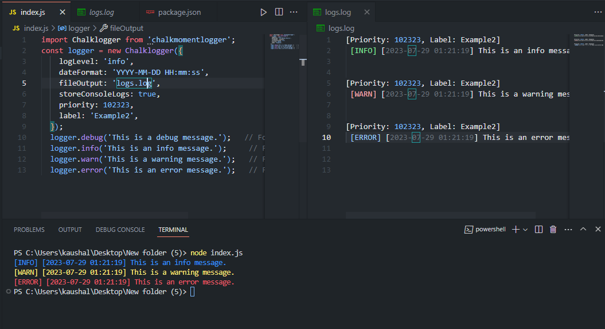

# Chalkmomentlogger

[](https://www.npmjs.com/package/chalkmomentlogger)

ChalkMomentlogger is a lightweight Node.js module that provides easy logging functionalities for your projects. With ChalkMomentlogger, you can output log messages to the console and optionally save them to a log file. It supports different log levels and allows you to customize the log format.

## Installation

You can install Chalkmomentlogger in your Node.js project using npm:

```
npm install Chalkmomentlogger
```

**Note : Chalkmomentlogger is an ES module so you may need to add "type":"module" in package.json**

## Getting Started

To use Chalkmomentlogger in your project, follow these steps:

1. Install the module as described in the Installation section.

2. Import the logger in your Node.js files:
```
import Chalklogger from 'Chalkmomentlogger';
```
3. Creating a Logger
```
const logger = new Chalklogger({
  logLevel: 'debug',
  fileOutput: './logs/app.log',
  storeConsoleLogs: true,
  priority: 'HIGH', // Can be any string
  label: 'Database', // Can be any string
});
```

4. Start logging messages:
```
logger.debug('This is a debug message.');   // For debugging information
logger.info('This is an info message.');     // For general information
logger.warn('This is a warning message.');   // For warnings
logger.error('This is an error message.');   // For errors
```
## Log Levels

Chalkmomentlogger supports the following log levels, in order of severity:

* debug: For debugging information.
* info: For general information (default level).
* warn: For warnings.
* error: For errors.

```
logger.debug('This is a debug message.');   // Will be shown only if log level is 'debug'
logger.info('This is an info message.');     // Will be shown if log level is 'debug' or 'info'
logger.warn('This is a warning message.');   // Will be shown if log level is 'debug', 'info', or 'warn'
logger.error('This is an error message.');   // Will be shown if log level is 'debug', 'info', 'warn', or 'error'
```
## Log Formatting
The logger formats log messages with different colors based on the log level:

* debug: Gray
* info: Blue
* warn: Yellow
* error: Red

The log format is [LOG_LEVEL] [TIMESTAMP] MESSAGE [PRIORITY, LABEL] if 'priority' and 'label' are provided.

## Demo



